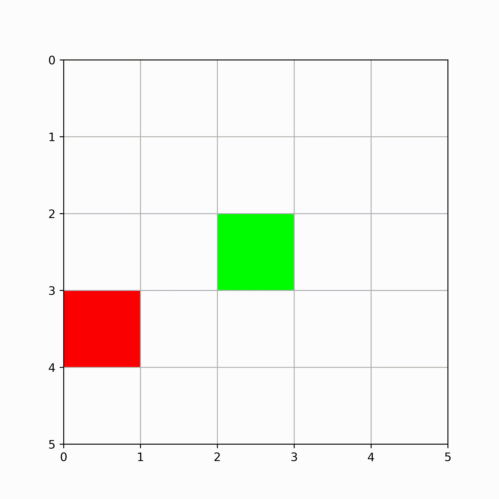

# Planning in Meta RL

Implementation of recurrent **Meta-Reinforcement Learning (Meta-RL)** agents together with **Linear Probing** utilities for investigating planning and memory representations learned by the agents.

<p align="center">
    
</p>

## Features

This repository contains implementations of **Proximal Policy Optimization (PPO)** in the **RL²** setting with the following recurrent architectures:

- Long Short-Term Memory (LSTM)
- Gated Recurrent Unit (GRU)
- Convolutional Gated Recurrent Unit (ConvGRU)

## Installation

This project uses **uv** for dependency management. All package versions are specified in `uv.lock`, ensuring reproducible python environments across machines.

Clone the repository:

```bash
git clone https://github.com/RelentlessViper/meta-rl-planning.git
cd meta-rl-planning
```

Create a virtual environment:

```bash
uv venv
```

Activate it:

**Linux/macOS**

```bash
source .venv/bin/activate
```

**Windows (PowerShell)**

```powershell
.venv\Scripts\Activate.ps1
```

Install all dependencies:

```bash
uv sync
```

## Supported environments

The implementations currently support the following benchmark environments:

- [Dark Room](https://github.com/corl-team/toy-meta-gym)
- [Box World](https://github.com/nathangrinsztajn/Box-World)

## Example workflow

The typical workflow consists of three stages:

1. Train a Meta-RL agent.
2. Collect a probing dataset using the trained model.
3. Train linear probes on the collected hidden states.

### 1. Train a Meta-RL agent

The following command trains a ConvGRU agent on Box World.

```bash
python box-world/ppo_conv_gru_masked_boxworld.py \
    --exp_name="convgru_boxworld" \
    --field_size=10 \
    --goal_length=3 \
    --num_distractor=3 \
    --total_timesteps=200000000 \
    --num_envs=1024 \
    --num_steps=64 \
    --hidden_size=256 \
    --num_layers=2 \
    --num_trials=3 \
    --capture_video=True \
    --save_best_model=True \
    --save_model_path=path/to/checkpoints
```

Once training is finished, use the saved checkpoint to generate a probing dataset.

### 2. Collect a probing dataset

This step runs the trained policy, records hidden states, and stores them for later probe training.

```bash
python box-world/1x1_probe/create_probe_dataset.py \
    --model_checkpoint_path=path/to/checkpoints/model.pt \
    --hidden_size=256 \
    --num_layers=2 \
    --field_size=10 \
    --goal_length=3 \
    --num_distractor=3 \
    --num_episodes=5000 \
    --save_path=path/to/datasets
```

After the dataset has been created, train a linear probe.

### 3. Train a linear probe

```bash
python box-world/1x1_probe/train_probe.py \
    --dataset_path=path/to/datasets/probe_dataset.pt \
    --save_path_probe=path/to/probes \
    --save_path_report=path/to/reports \
    --seed=42
```